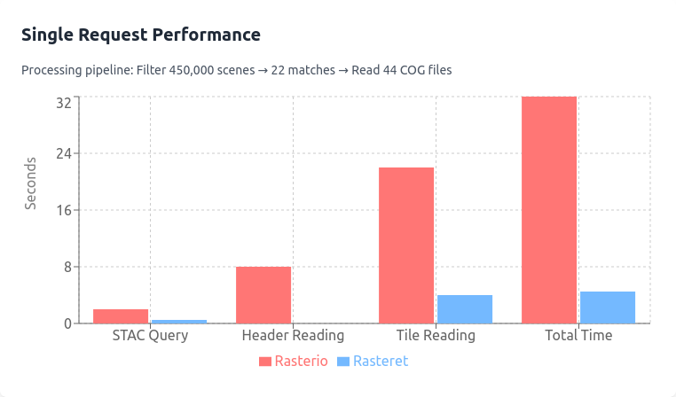
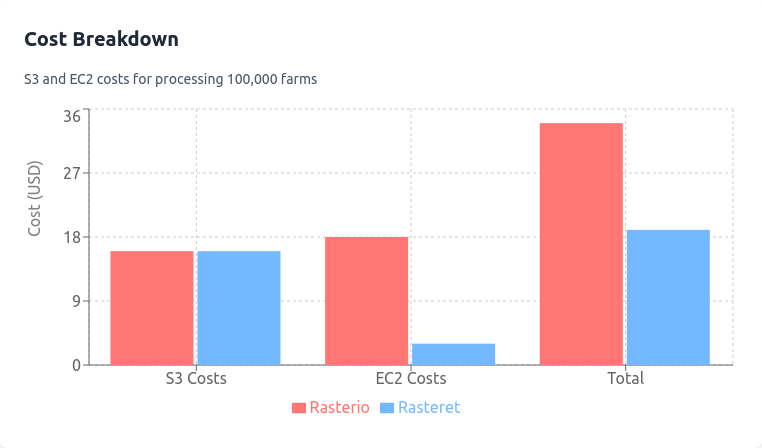
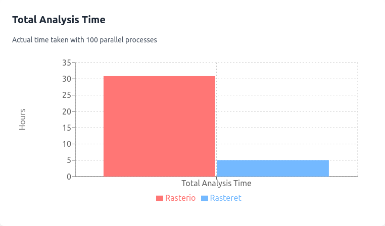
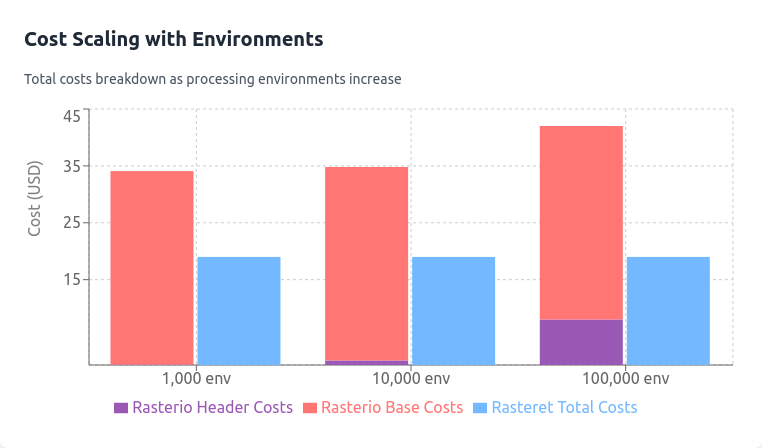

# 🛰️ Rasteret

This library gives you faster querying of Cloud-Optimized GeoTIFFs (COGs), and lowers S3 HTTP requests in your workflows.

> [!WARNING]  
> Work-in-progress library. The APIs are subject to change, and as such, documentation is not yet available.


## 📚 Table of Contents
- [Features](#-features)
- [Why Rasteret?](#-why-this-library)
- [Performance Benchmarks](#-performance-benchmarks)
- [Key Benefits](#-key-benefits)
- [Built-in Data Sources](#-built-in-data-sources)
- [Prerequisites](#%EF%B8%8F-prerequisites)
- [Installation](#-installation)
- [Quick Start](#%EF%B8%8F-quick-start)
- [License](#-license)
- [Notice](#-data-usage-terms)
- [Contributing](#-contributing)

<br>

## 🚀 Features
- ⚡ Fast byte-range based COG data retrieval
- 📦 STAC Geoparquet creation with COG header metadata 
- 💳 Paid data source support (Landsat on AWS S3)
- 📊 Xarray and GeoDataFrame outputs
- ⚙️ Parallel data loading
- 🎯 Simple high-level API

<br>

## 🤔 Why this library?

### 💡 The Problem

Getting satellite imagery from cloud storage is currently slow and expensive. Why? Every time your code runs, it needs to:

1. Make multiple HTTP requests just to read file headers
2. Do this again in new environments (think Docker containers, AWS Lambda, or just restarting your Jupyter notebook)
3. Finally make more requests to get the actual image data

<br>

### ✨ Rasteret's Solution 

We fixed this by:
- Creating a local cache that holds COG file headers along with STAC metadata
- Making just one HTTP request per image tile
- Keeping everything fast across environments - no more repeated requests!
- Running operations in parallel for blazing fast speeds (0.1 sec/tile on 4 cores)

<br>

### 📊 Performance Benchmarks

#### ⚡ Speed Comparison




#### Single Farm NDVI Time Series (1 Year of Landsat 9 Data)

Run on AWS t3.xlarge 4 CPU machine -

| Library | First Run | Subsequent Runs |
|---------|-----------|-----------------|
| Rasterio (Multiprocessing) | 32 seconds | 24 seconds |
| Rasteret | 4 seconds | 4 seconds |
| Popular Web Platform* | 10-30 seconds | 3-5 seconds |

*that platform which shall not be named


#### Rasteret Collection Creation Times & Costs

Run on AWS t3.xlarge 4 CPU machine -

| Scope | Time | AWS S3 GET Cost |
|-------|------|-----------------|
| Global (1 year) | ~30 minutes | $1.80 |
| Regional (1 year, for state of Karnataka, India) | ~45 seconds | Negligible |

### Large Scale Cost Analysis

Example scenario analyzing 100,000 farms with:
- 2 Landsat scenes covering all farms
- 45 dates per scene
- 4 bands per date
- Total: 360 COG files (200 after cloud filtering)
- Processing across 100 parallel environments (t3.xlarge)






### Cost analysis with New Environments (Dockers/Lambdas)

Rasterio/GDAL need to make repeated queries for COG headers in new environments
The more parallel and repetetive the workload, the higher the header GET costs are in Rasterio

**Same above Large scale analysis project's cost, with new environments is shown below**

| Environments | Repeated Header read Cost | Total Cost Rasterio |
|--------------|----------------|-------------|
| 1,000 | +$0.08 | $34.088 |
| 10,000 | +$0.8 | $34.808 |
| 100,000 | +$8.0 | $42.008 |

Rasteret maintains consistent $19.00 cost regardless of new environments.




<br>

More details in blog [here](https://blog.terrafloww.com/rasteret-a-library-for-faster-and-cheaper-open-satellite-data-access/)

### 🎯 Key Benefits

Rasteret is particularly effective for:
- 📈 Time series analysis requiring many scenes
- 🤖 ML pipelines with multiple training runs
- ☁️ Production systems using serverless/container deployments
- 👥 Multi-tenant applications accessing same data
- 🔄 Not needing to convert COG to Zarr for timeseries analysis

<br>

## 🌍 Built-in Data Sources
- Sentinel-2 Level 2A
    - Earthsearch v1 [STAC Endpoint](https://earth-search.aws.element84.com/v1/collections/sentinel-2-l2a/) (AWS S3 US-West2 bucket)
- Landsat Collection 2 Level 2 SR
    - USGS Landsatlook STAC Server [Endpoint](https://landsatlook.usgs.gov/stac-server/collections/landsat-c2l2-sr/) (AWS S3 US-West2 bucket)

## ⚠️ Known Limitations
- Currently tested only with Sentinel-2 and Landsat 8,9 platform's data
- Creating or Loading a 'Rasteret Collection' from S3 is not yet supported

<br>

## ⚙️ Prerequisites
- Python 3.10.x,3.11.x
- AWS credentials (for accessing paid data like Landsat on AWS)

### ⚙️ AWS Credentials Setup

<details>
<summary><b>Setting up AWS credentials</b></summary>

(Prefferable) You can set up your AWS credentials by creating a `~/.aws/credentials` file with the following content:

```
[default]
aws_access_key_id = your_access_key
aws_secret_access_key = your_secret_key
```

Alternatively, you can set the credentials as environment variables:
```bash
export AWS_ACCESS_KEY_ID='your_access_key'
export AWS_SECRET_ACCESS_KEY='your_secret_key'
```
</details>

<br>

## 🔧 Installation
```bash
pip install rasteret
```

<br>

## 🏃‍♂️ Quick Start

### 1. Define Areas of Interest

Create polygons for your regions of interest:

```python
from pathlib import Path
from shapely.geometry import Polygon

from rasteret import Rasteret
from rasteret.constants import DataSources
from rasteret.core.utils import save_per_geometry

aoi1_polygon = Polygon([
    (77.55, 13.01),
    (77.58, 13.01),
    (77.58, 13.08),
    (77.55, 13.08),
    (77.55, 13.01)
])

aoi2_polygon = Polygon([
    (77.56, 13.02),
    (77.59, 13.02),
    (77.59, 13.09),
    (77.56, 13.09),
    (77.56, 13.02)
])

# Get the total bounds of all polygons above
bbox = aoi1_polygon.union(aoi2_polygon).bounds
# OR
# give even larger AOI bounds that covers all your future analysis areas
# eg., Polygon of a State or a Country
# bbox = country_polygon.bounds
```

### 2. Configure Rasteret

Set up basic parameters for data collection, and check for existing collection
in your workspace directory, if they were created earlier.

```python
# Collection configuration

# give your custom name for local collection, it will be attached to the
# beginning of the collection name for eg., bangalore_202401-12_landsat
custom_name = "bangalore"

# here we are aiming to write 1 year worth of STAC metadata and COG file headers to local disk
date_range = ("2024-01-01", "2024-12-31")

# choose from LANDSAT / SENTINEL2
data_source = DataSources.LANDSAT

# Set up workspace folder as you wish
workspace_dir = Path.home() / "rasteret_workspace"
workspace_dir.mkdir(exist_ok=True)

# List existing collections if there are any in the workspace folder
collections = Rasteret.list_collections(workspace_dir=workspace_dir)
for c in collections:
    print(f"- {c['name']}: {c['data_source']}, {c['date_range']}, {c['size']} scenes")
```

### 3. Initialize and Create Collection

```python
# Try loading existing collection
try:
    # example name given here
    processor = Rasteret.load_collection("bangalore_202401-12_landsat",workspace_dir=workspace_dir)
except ValueError:

    # Instantiate the Class
    processor = Rasteret(
        workspace_dir=workspace_dir,
        custom_name="bangalore",
        data_source=DataSources.LANDSAT,
        date_range=("2024-01-01", "2024-01-31")
    )

    # and create a new collection

    # we are giving the BBOX for which STAC items and their COG headers will be fetched
    # and also filtering using PySTAC filters for LANDSAT 8 platform specifically
    # from LANDSAT USGS STAC, and giving a scene level cloud-cover filter
    processor.create_collection(
        bbox=bbox,
        cloud_cover_lt=20,
        platform={"in": ["LANDSAT_8"]}
    )
```

### 4. Query the Collection and Process Data

```python
# Now we can query the collection created above, to get the data we want
# in this case 2 geometries, 2 bands, and a few PySTAC search filters are provided
ds = processor.get_xarray(
    geometries=[aoi1_polygon,aoi2_polygon],
    bands=["B4", "B5"],
    cloud_cover_lt=20,
    date_range=["2024-01-10", "2024-01-30"]
)
# this returns an xarray dataset variable "ds" with the data for the geometries and bands specified
# behind the scenes, the library is efficiently filtering the local STAC geoparquet,
# for the LANDSAT scenes that pass the filters and dates provided
# then its getting the tif urls of the requested bands
# then grabbing COG tiles only for the geometries from those tif files
# and creating a xarray dataset for each geometry and its time series data

# Calculate NDVI
ndvi_ds = (ds.B5 - ds.B4) / (ds.B5 + ds.B4)

# give a data variable name for NDVI array
ndvi_ds = xr.Dataset(
    {"NDVI": ndvi},
    coords=ds.coords,
    attrs=ds.attrs,
)

# create a output folder if you wish to
output_dir = Path(f"ndvi_results_{custom_name}")
output_dir.mkdir(exist_ok=True)

# Save results from xarray to geotiff files, each geometry's data will be stored in
# its own folder. We can also give file-name prefix
# and also mention which Xarray varible to save as geotiffs
output_files = save_per_geometry(ndvi_ds, output_dir, file_prefix="ndvi", data_var="NDVI")

for geom_id, filepath in output_files.items():
    print(f"Geometry {geom_id}: {filepath}")

# example print    
# geometry_1 : ndvi_results_bangalore/geometry_1/ndvi_20241207.tif
```

<br>

---

## 📝 License

This project is licensed under the terms of the Apache 2.0 License.

For a copy of the license, see the [LICENSE](./LICENSE) file in this repository.

<br>

## 🤝 Contributing
Contributions welcome!

## Data Usage Terms
Please note that while the Rasteret library code is licensed as Apache 2.0, the data files generated by the library are subject to the license mentioned in the [NOTICE](./NOTICE)