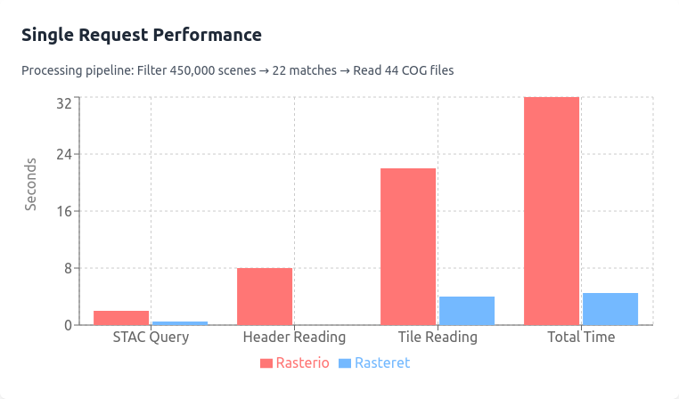
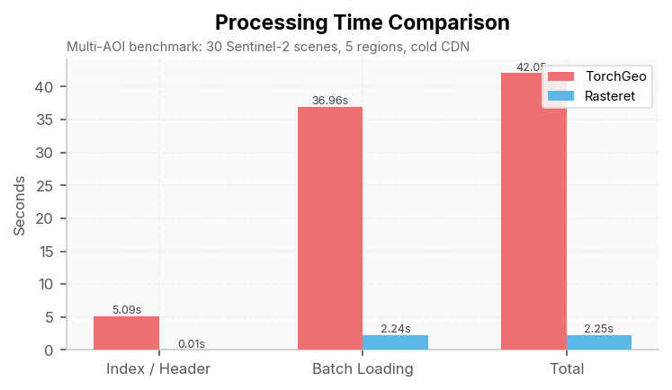
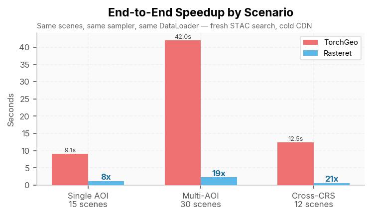
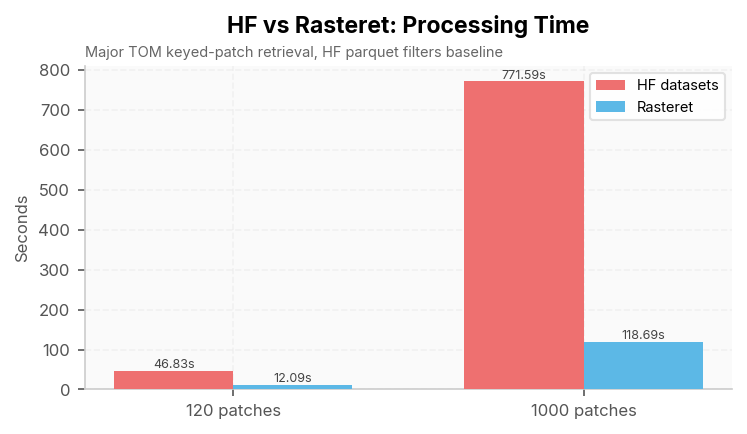
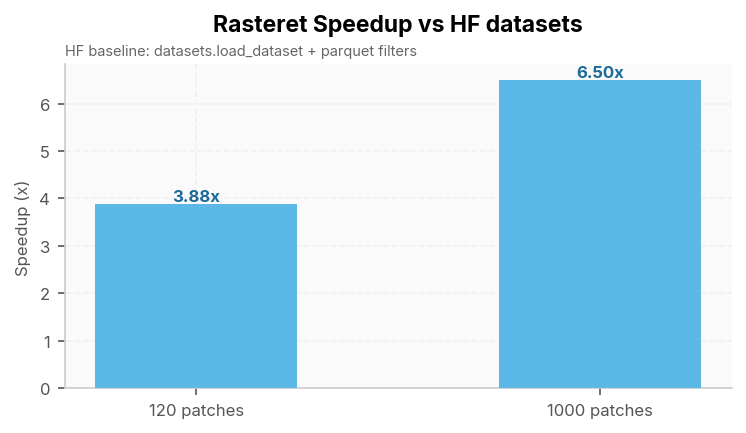

<h1 align="center">🛰️ Rasteret</h1>

<p align="center">
  <strong>Made to beat cold starts.</strong><br>
</p>
<p align="center">
Rasteret is a Python library for fast reads of geospatial imagery. Upto 20x faster than Rasterio/GDAL <br>
It interops with STAC, GeoParquet, TorchGeo, xarray, NumPy and with Arrow compatible tools like DuckDB, Polars<br>
</p>

<p align="center">
  <a href="https://terrafloww.github.io/rasteret"></a>
  <a href="https://discord.gg/V5vvuEBc"></a>
  <a href="https://pypi.org/project/rasteret/"></a>
  <a href="https://pypi.org/project/rasteret/"></a>
  <a href="LICENSE"></a>
</p>

---


Every cold start re-parses satellite image metadata over HTTP - per
scene, per band. Sentinel-2, Landsat, NAIP, every time. Your colleague
did it last Tuesday, CI did it overnight, PyTorch respawns DataLoader
workers every epoch. A single project repeats **millions of redundant
requests** before a pixel moves.

Rasteret parses those headers **once**, caches them in Parquet, and its
own reader fetches pixels concurrently with no GDAL in the path.
**Up to 20x faster** on cold starts.

Rasteret separates the runtime querying into two parts:
Rasteret separates the runtime querying into two parts:
Rasteret separates the runtime querying into two parts:

- **Control plane**: Parquet metadata, cached COG headers, and user columns like labels or splits
- **Data plane**: on-demand byte-range reads from the original GeoTIFF/COG objects
- **Control plane**: Parquet metadata, cached COG headers, and user columns like labels or splits
- **Data plane**: on-demand byte-range reads from the original GeoTIFF/COG objects
- **Control plane**: Parquet metadata, cached COG headers, and user columns like labels or splits
- **Data plane**: on-demand byte-range reads from the original GeoTIFF/COG objects
- **Control plane**: Parquet metadata, cached COG headers, and user columns like labels or splits
- **Data plane**: on-demand byte-range reads from the original GeoTIFF/COG objects

Key Features -
- **Easy** - Use prebuilt dataset catalog just three lines to read GeoTIFFs into a TorchGeo dataset, Xarray, GeoDataFrame or Numpy arrays.
- **Upto 20x faster, saves cloud LISTs and GETs** - Our custom I/O reads image tiles fast with zero STAC/header overhead once a Collection is built
- **Zero data downloads** - work with terabytes of geosaptial imagery while storing only megabytes of metadata.
- **No STAC at training time** - query once at collection setup; zero API calls during ML training.
- **Shareable Reproducible cache** - enrich the Collection with your ML splits, patch geometries, custom data points for ML, and share it, don't write folders of image chips!
- **Easy** - Use prebuilt dataset catalog just three lines to read GeoTIFFs into a TorchGeo dataset, Xarray, GeoDataFrame or Numpy arrays.
- **Upto 20x faster, saves cloud LISTs and GETs** - Our custom I/O reads image tiles fast with zero STAC/header overhead once a Collection is built
- **Zero data downloads** - work with terabytes of geosaptial imagery while storing only megabytes of metadata.
- **No STAC at training time** - query once at collection setup; zero API calls during ML training.
- **Shareable Reproducible cache** - enrich the Collection with your ML splits, patch geometries, custom data points for ML, and share it, don't write folders of image chips!
- **Easy** - Use prebuilt dataset catalog just three lines to read GeoTIFFs into a TorchGeo dataset, Xarray, GeoDataFrame or Numpy arrays.
- **Upto 20x faster, saves cloud LISTs and GETs** - Our custom I/O reads image tiles fast with zero STAC/header overhead once a Collection is built
- **Zero data downloads** - work with terabytes of geosaptial imagery while storing only megabytes of metadata.
- **No STAC at training time** - query once at collection setup; zero API calls during ML training.
- **Shareable Reproducible cache** - enrich the Collection with your ML splits, patch geometries, custom data points for ML, and share it, don't write folders of image chips!

---

#### Read performance for on Landsat 9 data

Run on AWS small machine t3.xlarge (4 vCPU) —
Processing pipeline: 650 acres Polygon input, Filter 450,000 scenes -> 22 matches -> Read 44 COG files pixels -> Compute NDVI graph

| Library | First Run | Subsequent Runs |
|---------|-----------|-----------------|
| **Rasterio** + Python Multiprocess | 32 s | 24 s |
| **Rasteret** | 3 s | 3 s |
| **Google Earth Engine** | 10–30 s | 3–5 s |


---

#### Read performance for on Landsat 9 data

Run on AWS small machine t3.xlarge (4 vCPU) —
Processing pipeline: 650 acres Polygon input, Filter 450,000 scenes -> 22 matches -> Read 44 COG files pixels -> Compute NDVI graph

| Library | First Run | Subsequent Runs |
|---------|-----------|-----------------|
| **Rasterio** + Python Multiprocess | 32 s | 24 s |
| **Rasteret** | 3 s | 3 s |
| **Google Earth Engine** | 10–30 s | 3–5 s |


---

#### Read performance for on Landsat 9 data

Run on AWS small machine t3.xlarge (4 vCPU) —
Processing pipeline: 650 acres Polygon input, Filter 450,000 scenes -> 22 matches -> Read 44 COG files pixels -> Compute NDVI graph

| Library | First Run | Subsequent Runs |
|---------|-----------|-----------------|
| **Rasterio** + Python Multiprocess | 32 s | 24 s |
| **Rasteret** | 3 s | 3 s |
| **Google Earth Engine** | 10–30 s | 3–5 s |


---

## Installation

Requires **Python 3.12+**.

```bash
uv pip install rasteret
```

<details>
<summary><strong>Extras</strong></summary>

```bash
uv pip install "rasteret[xarray]"       # + xarray output
uv pip install "rasteret[torchgeo]"     # + TorchGeo for ML pipelines
uv pip install "rasteret[aws]"          # + requester-pays buckets (Landsat, NAIP)
uv pip install "rasteret[azure]"        # + Planetary Computer signed URLs
```

Combine as needed: `uv pip install "rasteret[xarray,aws]"`.

Available extras: `xarray`, `torchgeo`, `aws`, `azure`, `earthdata`.
See [Getting Started](https://terrafloww.github.io/rasteret/getting-started/) for details.

> [!NOTE]
> **Requester-pays data (Landsat, etc.):** Install the `aws` extra and
> configure AWS credentials (`aws configure` or environment variables).
> Free public collections like Sentinel-2 on Element84 work without credentials.

</details>

---

## Built-in datasets

Rasteret ships with a growing catalog of datasets for ease of getting started.
Rasteret ships with a growing catalog of datasets for ease of getting started.
Rasteret ships with a growing catalog of datasets for ease of getting started.
Each entry includes license metadata and a `commercial_use` flag for quick
filtering.

Pick an ID, pass it to `build()` and go:
```
$ rasteret datasets list
ID                          Name                                       Coverage       License              Auth
aef/v1-annual               AlphaEarth Foundation Embeddings (Annual)  global         CC-BY-4.0            none
earthsearch/sentinel-2-l2a  Sentinel-2 Level-2A                        global         proprietary(free)    none
earthsearch/landsat-c2-l2   Landsat Collection 2 Level-2               global         proprietary(free)    required
earthsearch/naip            NAIP                                       north-america  proprietary(free)    required
earthsearch/cop-dem-glo-30  Copernicus DEM 30m                         global         proprietary(free)    none
earthsearch/cop-dem-glo-90  Copernicus DEM 90m                         global         proprietary(free)    none
pc/sentinel-2-l2a           Sentinel-2 Level-2A (Planetary Computer)   global         proprietary(free)    required
pc/io-lulc-annual-v02       ESRI 10m Land Use/Land Cover               global         CC-BY-4.0            required
pc/alos-dem                 ALOS World 3D 30m DEM                      global         proprietary(free)    required
pc/nasadem                  NASADEM                                    global         proprietary(free)    required
pc/esa-worldcover           ESA WorldCover                             global         CC-BY-4.0            required
pc/usda-cdl                 USDA Cropland Data Layer                   conus          proprietary(free)    required
```


## Use your own datasets
- Use `build_from_stac()` for any STAC API you want to query and cache as Rasteret Collection
- Use `build_from_table()` for Parquet files that already contain GeoTIFF/COG URLs inside them, see [tutorial](https://terrafloww.github.io/rasteret/tutorials/06_non_stac_cog_collections/) 
- Use `build_from_stac()` for any STAC API you want to query and cache as Rasteret Collection
- Use `build_from_table()` for Parquet files that already contain GeoTIFF/COG URLs inside them, see [tutorial](https://terrafloww.github.io/rasteret/tutorials/06_non_stac_cog_collections/) 
- Use `build_from_stac()` for any STAC API you want to query and cache as Rasteret Collection
- Use `build_from_table()` for Parquet files that already contain GeoTIFF/COG URLs inside them, see [tutorial](https://terrafloww.github.io/rasteret/tutorials/06_non_stac_cog_collections/) 

You can also build collections using CLI `rasteret collections build` read more details [here](https://terrafloww.github.io/rasteret/how-to/collection-management/)


## Quick start
### Build a Collection

```python
import rasteret

# build_from_stac(), #build_from_table() for your own datasets
# build_from_stac(), #build_from_table() for your own datasets
# build_from_stac(), #build_from_table() for your own datasets
collection = rasteret.build(
    "earthsearch/sentinel-2-l2a",
    name="s2_training",
    bbox=(77.5, 12.9, 77.7, 13.1),
    date_range=("2024-01-01", "2024-06-30"),
)
```

### Inspect and filter

```python
collection        # Collection('s2_training', source='sentinel-2-l2a', bands=13, records=42, crs=32643)
collection.bands  # ['B01', 'B02', ..., 'B12', 'SCL']
len(collection)   # 42


# Filter in memory, no network calls
filtered = collection.subset(cloud_cover_lt=15, date_range=("2024-03-01", "2024-06-01"))
```

`subset()` accepts `cloud_cover_lt`, `date_range`, `bbox`, `geometries`,
`split`, and `split_column` 
`split`, and `split_column` 
`split`, and `split_column` 

### ML training (TorchGeo)

```python
from torch.utils.data import DataLoader
from torchgeo.samplers import RandomGeoSampler
from torchgeo.datasets.utils import stack_samples

dataset = collection.to_torchgeo_dataset(
    bands=["B04", "B03", "B02", "B08"],
    chip_size=256,
)

sampler = RandomGeoSampler(dataset, size=256, length=100)
loader = DataLoader(dataset, sampler=sampler, batch_size=4, collate_fn=stack_samples)
```

### Analysis (xarray)

```python
ds = collection.get_xarray(
    geometries=(77.55, 13.01, 77.58, 13.08),  # bbox, Arrow array, Shapely, or WKB
    bands=["B04", "B08"],
)
ndvi = (ds.B08 - ds.B04) / (ds.B08 + ds.B04)
```

### Fast arrays (NumPy)

```python
arr = collection.get_numpy(
    geometries=(77.55, 13.01, 77.58, 13.08),
    bands=["B04", "B08"],
)
# shape: [N, C, H, W] for multi-band, [N, H, W] for single-band
```

<summary><strong>Going further</strong></summary>

| What | Where |
|---|---|
| STAC APIs not in the catalog | [`build_from_stac()`](https://terrafloww.github.io/rasteret/how-to/collection-management/) |
| Parquet with COG URLs in them (Source Cooperative, STAC GeoParquet, custom) | [`build_from_table(path, name=...)`](https://terrafloww.github.io/rasteret/how-to/build-from-parquet/) |
| STAC APIs not in the catalog | [`build_from_stac()`](https://terrafloww.github.io/rasteret/how-to/collection-management/) |
| Parquet with COG URLs in them (Source Cooperative, STAC GeoParquet, custom) | [`build_from_table(path, name=...)`](https://terrafloww.github.io/rasteret/how-to/build-from-parquet/) |
| STAC APIs not in the catalog | [`build_from_stac()`](https://terrafloww.github.io/rasteret/how-to/collection-management/) |
| Parquet with COG URLs in them (Source Cooperative, STAC GeoParquet, custom) | [`build_from_table(path, name=...)`](https://terrafloww.github.io/rasteret/how-to/build-from-parquet/) |
| Multi-band COGs (AEF embeddings, etc.) | [AEF Embeddings guide](https://terrafloww.github.io/rasteret/how-to/aef-embeddings/) |
| Authenticated sources (PC, requester-pays, Earthdata, etc.) | [Custom Cloud Provider](https://terrafloww.github.io/rasteret/how-to/custom-cloud-provider/) |
| Share a Collection | `collection.export("path/")` then `rasteret.load("path/")` |

---

## Benchmarks

### Cold-start comparison with TorchGeo

Same AOIs, same scenes, same sampler, same DataLoader. Both paths output
identical `[batch, T, C, H, W]` tensors. TorchGeo runs with its
recommended GDAL settings for best-case remote COG performance.

| Scenario | rasterio/GDAL path | Rasteret path | Ratio |
|---|---|---|---|
| Single AOI, 15 scenes | 9.08 s | 1.14 s | **8x** |
| Multi-AOI, 30 scenes | 42.05 s | 2.25 s | **19x** |
| Cross-CRS boundary, 12 scenes | 12.47 s | 0.59 s | **21x** |

The speed difference comes from how headers are accessed and Rasteret's custom I/O engine. rasterio/GDAL
The speed difference comes from how headers are accessed and Rasteret's custom I/O engine. rasterio/GDAL
The speed difference comes from how headers are accessed and Rasteret's custom I/O engine. rasterio/GDAL
path re-parses IFDs over HTTP on each cold start, while Rasteret reads
them from a local Parquet cache. See
[Benchmarks](https://terrafloww.github.io/rasteret/explanation/benchmark/)
for full methodology.




### HuggingFace Major-TOMCore 'images-inside-parquet' dataset vs Rasteret

There have been attempts to put 'patches' of geotiff imagery inside Parquet files instead of using COGs, and in ML training or Inference read these Parquet files at runtime, one such popular dataset is 'MajorTOM SentinelL2A' in HuggingFace.

Rasteret and its parquet based Collection metadata means you can create such patches in the parquet and use Rasteret's I/O to read those patches as needed. 
You can create H3 or A5 indices based cell patches, or regular grids as you wish. All before touching pixels in COGs, and not having to actually move images inside Parquet.

Rasteret beats reading 'images-inside-parquet' datasets while giving you freedom to create any kind of patching you wish at metadata level.
### HuggingFace Major-TOMCore 'images-inside-parquet' dataset vs Rasteret

There have been attempts to put 'patches' of geotiff imagery inside Parquet files instead of using COGs, and in ML training or Inference read these Parquet files at runtime, one such popular dataset is 'MajorTOM SentinelL2A' in HuggingFace.

Rasteret and its parquet based Collection metadata means you can create such patches in the parquet and use Rasteret's I/O to read those patches as needed. 
You can create H3 or A5 indices based cell patches, or regular grids as you wish. All before touching pixels in COGs, and not having to actually move images inside Parquet.

Rasteret beats reading 'images-inside-parquet' datasets while giving you freedom to create any kind of patching you wish at metadata level.
### HuggingFace Major-TOMCore 'images-inside-parquet' dataset vs Rasteret

There have been attempts to put 'patches' of geotiff imagery inside Parquet files instead of using COGs, and in ML training or Inference read these Parquet files at runtime, one such popular dataset is 'MajorTOM SentinelL2A' in HuggingFace.

Rasteret and its parquet based Collection metadata means you can create such patches in the parquet and use Rasteret's I/O to read those patches as needed. 
You can create H3 or A5 indices based cell patches, or regular grids as you wish. All before touching pixels in COGs, and not having to actually move images inside Parquet.

Rasteret beats reading 'images-inside-parquet' datasets while giving you freedom to create any kind of patching you wish at metadata level.

Baseline method HF library: `datasets.load_dataset(..., streaming=True, filters=...)` , compared against Rasteret prebuilt index reads.
Baseline method HF library: `datasets.load_dataset(..., streaming=True, filters=...)` , compared against Rasteret prebuilt index reads.
Baseline method HF library: `datasets.load_dataset(..., streaming=True, filters=...)` , compared against Rasteret prebuilt index reads.
Reproduce with `examples/major_tom_benchmark/03_hf_vs_rasteret_benchmark.py`.

| Patches | HF `datasets` (streaming) | Rasteret index+COGs | Speedup |
| Patches | HF `datasets` (streaming) | Rasteret index+COGs | Speedup |
| Patches | HF `datasets` (streaming) | Rasteret index+COGs | Speedup |
|---:|---:|---:|---:|
| 120 | 46.83 s | 12.09 s | **3.88x** |
| 1000 | 771.59 s | 118.69 s | **6.50x** |





Notebook: [`05_torchgeo_comparison.ipynb`](docs/tutorials/05_torchgeo_comparison.ipynb)

> [!NOTE]
> Measured on an EC2 instance in the same region as the data (us-west-2).
> TorchGeo timings above use 12-30 scenes; HF timings above use 120/1000 patches.
> Results vary with network conditions.
> If you run Rasteret on your own workloads, share your numbers on
> [GitHub Discussions](https://github.com/terrafloww/rasteret/discussions/categories/show-and-tell)
> or [Discord](https://discord.gg/V5vvuEBc).


---

## Scope and stability

| Area | Status |
|---|---|
| STAC + COG scene workflows | Stable |
| Parquet-first workflows (`build_from_table()`) | Stable |
| Multi-band / planar-separate COGs (`band_index`) | Stable |
| Multi-cloud (S3, Azure Blob, GCS) | Stable |
| Dataset catalog | Stable |
| TorchGeo adapter | Stable |

Rasteret is optimized for **remote, tiled GeoTIFFs** (COGs). It also works
with local tiled GeoTIFFs for indexing, filtering, and sharing collections.
Non-tiled TIFFs and non-TIFF formats are best handled by TorchGeo or rasterio.

---

## Documentation

Full docs at **[terrafloww.github.io/rasteret](https://terrafloww.github.io/rasteret)**:

| | |
|---|---|
| [Getting Started](https://terrafloww.github.io/rasteret/getting-started/) | Installation and first steps |
| [Tutorials](https://terrafloww.github.io/rasteret/tutorials/) | Hands-on notebooks |
| [How-To Guides](https://terrafloww.github.io/rasteret/how-to/) | Task-oriented recipes |
| [API Reference](https://terrafloww.github.io/rasteret/reference/) | Auto-generated from source |
| [Architecture](https://terrafloww.github.io/rasteret/explanation/architecture/) | Design decisions |
| [Ecosystem Comparison](https://terrafloww.github.io/rasteret/explanation/interop/) | Rasteret vs TACO, async-geotiff, virtual-tiff |

## Contributing

The catalog grows with community help:

- **Add a dataset**: write a ~20 line descriptor in `catalog.py`, open a PR. See [prerequisites](https://terrafloww.github.io/rasteret/how-to/dataset-catalog/#prerequisites-for-contributing-a-built-in-dataset) and [guide](https://terrafloww.github.io/rasteret/how-to/dataset-catalog/#add-your-own-catalog-entries-advanced)
- **Improve docs**: fix a typo, add an example, clarify a section
- **Build something new**: ingest drivers, cloud backends, readers. See [Architecture](https://terrafloww.github.io/rasteret/explanation/architecture/)

All contributions are welcome.
See [Contributing](https://terrafloww.github.io/rasteret/contributing/) for dev setup and we are happy to discuss all aspects of library.
Ideas welcome on [GitHub Discussions](https://github.com/terrafloww/rasteret/discussions) or join our [Discord](https://discord.gg/V5vvuEBc) to just chat.

## Technical notes

<details>
<summary><strong>GeoParquet and Parquet Raster</strong></summary>

Rasteret Collections are written as **GeoParquet 1.1** (WKB footprint geometry
+ `geo` metadata; coordinates in CRS84). Parquet is adding native
`GEOMETRY`/`GEOGRAPHY` logical types and GeoParquet 2.0 is evolving alongside
that; Rasteret tracks this and plans to adopt when ecosystem support stabilizes.

GeoParquet also has an **alpha "Parquet Raster"** draft for storing raster
payloads in Parquet. Rasteret does **not** write Parquet Raster files: pixels
stay in GeoTIFF/COGs, and Parquet stays the index.

</details>

<details>
<summary><strong>TorchGeo interop</strong></summary>

`RasteretGeoDataset` is a standard TorchGeo `GeoDataset` subclass. It honors
the full GeoDataset contract:

- `__getitem__(GeoSlice)` returns `{"image": Tensor, "bounds": Tensor, "transform": Tensor}`
- `index` is a GeoPandas GeoDataFrame with an IntervalIndex named `"datetime"`
- `crs` and `res` are set correctly for sampler compatibility
- Works with `RandomGeoSampler`, `GridGeoSampler`, and any custom sampler
- Works with `IntersectionDataset` and `UnionDataset` for dataset composition

Rasteret replaces the I/O backend (custom IO instead of rasterio/GDAL) but
speaks the same interface. Your samplers, DataLoader, transforms, and training
loop do not change.

Rasteret can also add extra keys to the sample dict (e.g. `label` from a
metadata column) without breaking interop - TorchGeo ignores unknown keys.

TorchGeo's rasterio/GDAL-backed `RasterDataset` remains the right choice for
non-tiled TIFFs and non-TIFF formats.

</details>

## License

Code: [Apache-2.0](LICENSE)
